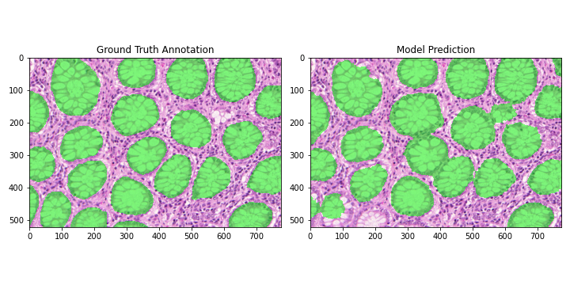
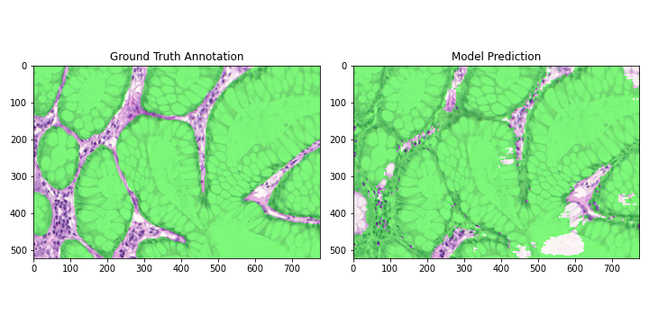

# UNet-ResNet Segmentation

## Examples from pre-trained model
1) Example prediction on training set.


2) Example prediction on validation set.


3) Example prediction on validation set, unrepresented in training data.


### Pre-trained Model Details
- ResNet18 encoder and decoder backbone.
- Channel configuration of (32, 64, 128, 256).
- Trained for 5253 epochs (~12 hours).
- Settings as configured in config files.
- Model was trained locally on Linux Mint 20.2, on a RTX 3060 mobile GPU.

## Setting up Requirements
1) Ensure **Python 3.7** and above is installed.
2) Clone this repository.
3) Navigate to the repository folder.
    ```
    $ cd /path/to/repository/folder
    ```
4) Install PyTorch based on https://pytorch.org/get-started/locally/. Code was tested on Linux using the following PyTorch install command.
    ```
    $ pip3 install torch torchvision torchaudio --extra-index-url https://download.pytorch.org/whl/cu113
    ```
5) Install requirements from `requirements/pip/requirements.txt`.
    ```
    $ pip install -r requirements.txt
    ```

## Running Training
1) Navigate to this repository folder.
    ```
    $ cd /path/to/repository/folder
    ```
1) Download the GLAS dataset from https://warwick.ac.uk/fac/cross_fac/tia/data/glascontest/download/.
2) Extract the GLAS dataset, set the path to the dataset folder in `config/data.py`
    ```python
    DATA_FOLDER = "/path/to/extracted/warwick_qu_dataset_released_2016_07_08/Warwick QU Dataset (Released 2016_07_08)"
    ```
3) Configure training settings in `config/training.py`. Key settings are explained below. Further settings are available for more fine-grained control.
    ```python 
    # Path for saving model checkpoints and logs.
    # Can be used to resume previous training sessions.
    EXPERIMENT_NAME = "experiment"
    ...
    # Choose training device. Multi-GPU training is not implemented.
    DEVICE = "cuda:0"
    ...
    # Model will run for this many epochs.
    EPOCHS = 2000
    ...
    LEARNING_RATE = 5e-3    # AdamW optimizer is used by default.
    ...
    # Batch size is used for gradient accumulation.
    # To follow original UNet implementation:
    # set BATCH_SIZE=1, and DO_GRADIENT_ACCUMULATION=False
    BATCH_SIZE = 16     # If batch size is larger than 1, gradient accumulation will be done.
    DO_GRADIENT_ACCUMULATION = True
    ...
    ```
3) Configure model settings in `config/model.py`. Supported models include UNet and baseline FCN, using ResNet backbones. Note that ResNet50 backbones are incompatible with ResNet18 and ResNet34 backbones.
    ```python 
    class ModelConfig:
        # Supported model types: UNet, FCN
        MODEL_TYPE = "UNet"

        # Supported encoder and backbones: ResNet18, ResNet34, ResNet50
        ENCODER_BACKBONE = "ResNet18"
        DECODER_BACKBONE = "ResNet18"
    
    class ResNetConfig:
        """Configuration class for the ResNet backbone for the UNet model."""
        ACTIVATION_FUNCTION = nn.GELU               # Activation function for ResNet
        CHANNELS_ORDERING = [32, 64, 128, 256]      # Channels for each downsampling stage, can be modified freely.
        ...
        # Padding is used at the encoder and decoder stage. The padding mode can be chosen from PyTorch supported methods.
        ENCODER_PADDING_MODE = "circular"
    ```
4) (Optional) Run tests to ensure that:
    - Models compile successfully.
    - Data loads properly.
    - Augmentations are working.
    ```
    $ bash ./tests.sh
    ```
5) (Optional) Determine channel-wise statistics for normalization. Copy output to `config/image.py`.
    ```
    $ python find_mean_and_std_of_dataset.py
    ```
    ```python
    # Statistics were pre-computed based on training data.
    class ImageStatistics:
        CHANNEL_WISE_MEANS = [0.7874, 0.5112, 0.7851]
        CHANNEL_WISE_STDS = [0.1594, 0.2163, 0.1188]
    ```

8) Run model training.
    ```
    $ python train_model.py
    ```

**If model configurations are changed, re-cloning the repo is recommended, as prior trained models may not match the model configuration.**

## Use Trained Model for Inference
1) Navigate to this repository folder.
    ```
    $ cd /path/to/repository/folder
    ```
2) Ensure that a model has been trained, i.e. checkpoint files are available in `checkpoints`. 
    - By default, inference will load the model in the folder defined in `config/training.py/`.
    ```python
    EXPERIMENT_NAME = "experiment"
    ```
3) Run the inference file to preview the annotation of a single image.
    ```
    $ python run_inference.py -f /path/to/image.bmp
    ```
4) To save the annotated image to a file, pass an the output image path as an argument.
    ```
    $ python run_inference.py -f /path/to/image.bmp --output /path/to/annotated/image.png
    ```
5) To run inference on all image files in a folder, replace the input and output image paths with folder paths.
    ```
    $ python run_inference.py -f /path/to/folder/of/images --output /path/to/annotated/output/folder
    ```
6) To filter out images that include a substring, substring as the following argument. The example given filters out the annotation files from the GLAS dataset.
    ```
    $ python run_inference.py -f /path/to/folder/of/images -r _anno --output /path/to/annotated/output/folder
    ```
    - To filter by multiple substrings, multiple `-r` arguments can be passed. The example filters out the test set data from the GLAS dataset, while also filtering out the annotation files.
    ```
    $ python run_inference.py -f /path/to/folder/of/images -r _anno -r test --output /path/to/annotated/output/folder
    ```

7) To override using the default checkpoint, pass the path to the checkpoint file as an argument to run command. 
    ```
    $ python run_inference.py -c /path/to/checkpoint.pth.tar -f /path/to/image.bmp
    ```
8) By default, cpu mode is used for inference. To use GPU, add the following argument to the command.
    ```
    $ python run_inference.py -f /path/to/image.bmp -d cuda:0
    ```
9) (Optional) To use the pre-trained checkpoint, run the following command.
    ```
    $ python run_inference.py -c checkpoints/pretrained_resnet_18/checkpoint.pth.tar -f /path/to/image.bmp 
    ```
# Notes

## Model Architectures
A UNet (https://arxiv.org/abs/1505.04597) architecture is adopted, but with inspiration taken from TernausNet (https://arxiv.org/pdf/1801.05746.pdf), a segmentation model that uses a pre-trained VGG backbone for increased performnce.

To implement the UNet model, a ResNet backbone is used for both the encoder and decoder. This leverages the representational power of ResNet's architecture, while also allowing bottleneck blocks from deeper architectures to be used seamlessly as a decoder.

## Engineering Choices
The following engineering choices were used for model training. Certain choices were found to increase generalizability to the validation set, but also increased training time.
- Inputs were padded to ensure that encoder-decoder link connections retain the same size. As per original UNet paper, replicate-padding was used for the inputs.
- As ResNet includes batch normalization layers, gradient accumulation is used to emulate larger batch sizes, to prevent exploding gradients with batch sizes of 1.
- Padding in ResNet was changed from zero-padding to circular-padding for better performance in segmentation tasks, as noted in (https://arxiv.org/abs/2010.02178).
- GELU (https://arxiv.org/abs/1606.08415v3) activation was used to replace the ReLUs used in the original ResNet implementation. From experimentation, this seemed to accelerate training (at the cost of a negligible runtime penalty).
- ResNet channel configuration was halved (i.e. maximum channels of original was 512, maximum channels used for training was 256). This was done due to memory constraints, but can be modified in code.
- Similarly, ResNet18 backbones were used due to time and memory constraints.
- Model can definitely be improved with longer training time.

## Augmentations Used
- Random horizontal/vertical flipping.
- Random rotation and cropping (prevents black borders).
- Random zoom.
- ~~Elastic Deformation~~  *Implemented, but unused due to minimal visible effect, and no noticable impact on training and generalizability.*

Custom augmentation chains can be used by replacing the Compose() chains in `utilities/augmentations`. 

## References
Checkerboard pattern for transposed deconvolution layers.
- https://distill.pub/2016/deconv-checkerboard/


Fully Convolutional Network architecture
- https://arxiv.org/abs/1411.4038
- https://github.com/pochih/FCN-pytorch

UNet
- https://arxiv.org/abs/1505.04597
- https://arxiv.org/pdf/1801.05746.pdf
- https://github.com/ternaus/TernausNet/blob/master/ternausnet/models.py
- https://github.com/neptune-ai/open-solution-mapping-challenge/blob/master/src/unet_models.py

Elastic deformation implementations
- https://gist.github.com/chsasank/4d8f68caf01f041a6453e67fb30f8f5a
- https://github.com/hayashimasa/UNet-PyTorch/blob/main/augmentation.py
- *Both are slightly bugged, and will fail on non-square images, bugs are fixed in the implementation under* `/utilities/preprocessing/augments`.

Applying same transform to input and target
- https://discuss.pytorch.org/t/torchvision-transfors-how-to-perform-identical-transform-on-both-image-and-target/10606/7

UNet data loss in convolution, when encoder downsamples to odd numbers 
- 36 (enc) -> **18** (enc) -> **9** (enc) -> 4 (dec) -> **8** (dec) -> **16**
- https://stackoverflow.com/questions/60063797/not-understanding-the-data-flow-in-unet-like-architetures-and-having-problems-wi
